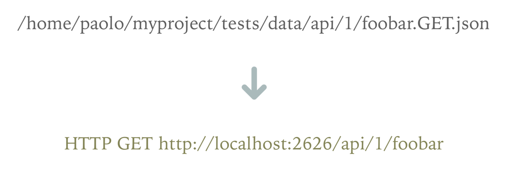

# Mocker
A simple HTTP mock server inspired by Saray

## How to install

Simply unpack the compressed file of a mocker distribution downloadable from
https://github.com/theghostwhocodes/mocker-go/releases and you are ready to go!

## The idea behind Mocker

Mocker is an HTTP server that transform a JSON file located in a file-system well defined path
into an HTTP response.



## File naming convention

The HTTP responses of this mocker are builded based on a filesystem hierarchy of JSON files.

The filename of your mocks are very important, because it determines when and how the mocks will be loaded.
The final part of your URL and the HTTP method define the name of the JSON file that Mocker will read to respond to your test requests.

Here is the file naming convention explained:


* **data path**: the root path used by mocker to read your data
* **API path**: the path, relative to your data path, that mimic the url path of your mocked api
* **resource**: the name of your resource, the final path of your url
* **HTTP verb**: the HTTP verb of your mock
* **optional part**: a filename optional part, needed to avoid file-system naming conflicts
* **extension**: actually only JSON is supported

## Example

For an HTTP GET:

- test URL to map: HTTP GET to /mock/some/data
- JSON file path: [root_path]/mock/some/data.GET.json

For a parametrized HTTP GET:

- test URL to map: HTTP GET to /mock/some/data?param1=value1&param2=value2
- JSON file path: [root_path]/mock/some/data?param1=value1&param2=value2.GET.json

The same applies for the others HTTP methods.

## Options and parameters

```
$ mocker --help
Usage of build/mocker:
  -d string
    	The data path (shorthand) (default "./data")
  -data string
    	The data path (default "./data")
  -h string
    	The host to listen (shorthand) (default "127.0.0.1")
  -host string
    	The host to listen (default "127.0.0.1")
  -p int
    	The TCP port to listen (shorthand) (default 8000)
  -pf string
    	The real API endpoint (shorthand)
  -port int
    	The TCP port to listen (default 8000)
  -proxy-for string
    	The real API endpoint
  -version
    	Mocker version
```
