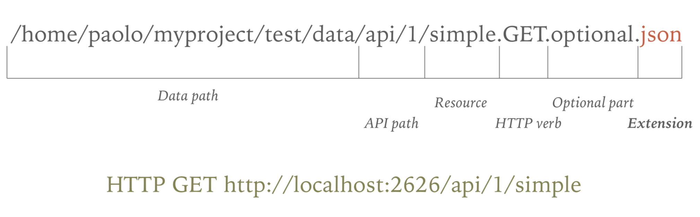

# Mocker
A simple HTTP mock server inspired by Saray

## The idea behind Mocker

Mocker is an HTTP server that transform a JSON file located in a file-system well defined path
into an HTTP response.

## File naming convention

The HTTP responses of this mocker are builded based on a filesystem hierarchy of JSON files.

The filename of your mocks are very important, because it determines when and how the mocks will be loaded.
The final part of your URL and the HTTP method define the name of the JSON file that Mocker will read to respond to your test requests.

Here is the file naming convention explained:

## Example

For an HTTP GET:

- test URL to map: HTTP GET to /mock/some/data
- JSON file path: [root_path]/mock/some/data.GET.json

For a parametrized HTTP GET:

- test URL to map: HTTP GET to /mock/some/data?param1=value1&param2=value2
- JSON file path: [root_path]/mock/some/data?param1=value1&param2=value2.GET.json

The same applies for the others HTTP methods.

## How to run

`$ mocker -path ./yourdatafolder`
